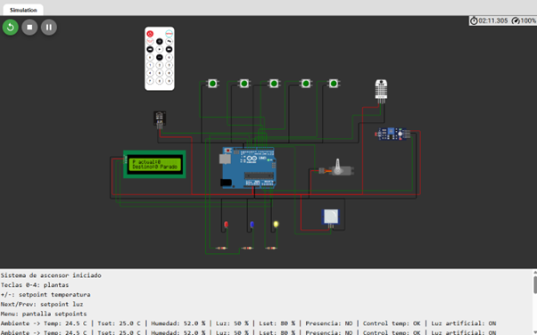
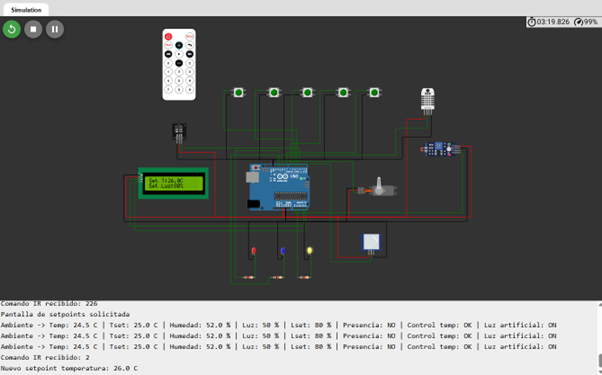
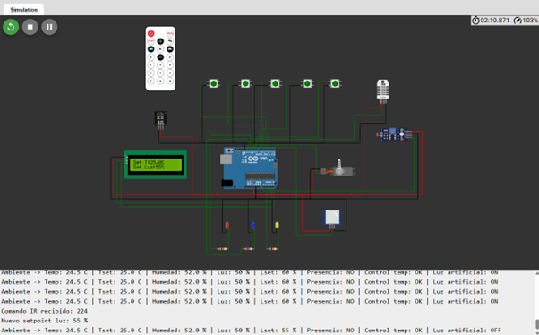

# Actividad 3 - Ascensor inteligente ACME 

 

## Descripción 

 

Este repositorio contiene el desarrollo de la Actividad 3 de la asignatura Equipos e Instrumentación Electrónica. 

 

El proyecto parte del sistema desarrollado en la Actividad 2, basado en un ascensor inteligente de cinco plantas implementado en Wokwi. En esta tercera actividad se perfecciona el sistema mediante una funcionalidad avanzada de control remoto de setpoints utilizando el mando infrarrojo. 

 

La mejora seleccionada permite modificar durante la simulación los valores deseados de temperatura e iluminación sin cambiar el código ni reiniciar el sistema. De esta forma, el sistema pasa de tener valores fijos de control a disponer de parámetros ajustables remotamente. 

 

## Enlace a la simulación en Wokwi 

 

https://wokwi.com/projects/465645801820187649 

 

## Integrantes del grupo 

 

- Víctor Serrano Corbelle 

- Mª Ángeles Salomón Pérez 

 

--- 

 

## Sistema base utilizado 

 

El sistema base corresponde al ascensor inteligente desarrollado en la Actividad 2. Este sistema integra: 

 

- Ascensor de cinco plantas. 

- Selección de planta mediante mando infrarrojo. 

- Llamada mediante pulsadores físicos por planta. 

- Servomotor para simular el desplazamiento de la cabina. 

- Sensor DHT22 para temperatura y humedad. 

- Sensor LDR para iluminación. 

- Sensor PIR para detección de presencia en cabina. 

- LEDs de actuación ambiental: 

  - LED rojo: calefacción. 

  - LED azul: refrigeración. 

  - LED amarillo: iluminación artificial. 

- Pantalla LCD 16x2 I2C como HMI local. 

- Control ON-OFF con zona muerta para temperatura. 

- Control de iluminación mediante umbral. 

 

El sistema base mantiene la lógica de funcionamiento de la Actividad 2 y sirve como plataforma sobre la que se añade la mejora avanzada de la Actividad 3. 

 

--- 

 

## Bill of Materials 
La siguiente tabla recoge los componentes empleados en la implementación física equivalente del sistema desarrollado en Wokwi.

| Designator | Descripción | Part Number | Cantidad | Coste Unitario (€) | Coste Total (€) |
|------------|-------------|-------------|----------|-------------------|----------------|
| U1 | Arduino Uno R3 | A000066 | 1 | 24,90 | 24,90 |
| DS1 | LCD 16x2 I2C | LCD1602 + PCF8574 | 1 | 5,50 | 5,50 |
| M1 | Micro Servo | SG90 | 1 | 3,00 | 3,00 |
| IR1 | Receptor IR | VS1838B | 1 | 0,70 | 0,70 |
| SW1-SW5 | Pulsadores NA | B3F-1000 | 5 | 0,30 | 1,50 |
| U2 | Sensor temperatura y humedad | DHT22 (AM2302) | 1 | 5,50 | 5,50 |
| LDR1 | Fotoresistencia | GL5528 | 1 | 0,20 | 0,20 |
| U3 | Sensor PIR | HC-SR501 | 1 | 2,50 | 2,50 |
| D1 | LED rojo | LTL-307EE | 1 | 0,10 | 0,10 |
| D2 | LED azul | LTL-4232N | 1 | 0,10 | 0,10 |
| D3 | LED amarillo | LTL-307Y | 1 | 0,10 | 0,10 |
| R1-R3 | Resistencias 1 kΩ | CFR-25JB-1K | 3 | 0,02 | 0,06 |

**Coste total estimado del sistema:** **44,16 €**

 

--- 

 

## Mejora implementada en la Actividad 3 

 

La mejora seleccionada es el **control remoto de setpoints mediante mando infrarrojo**. 

 

Esta funcionalidad se ha elegido porque permite perfeccionar el sistema sin modificar el circuito base, aprovechando el receptor IR y el mando ya integrados en la Actividad 2. Gracias a esta mejora, el usuario puede ajustar remotamente los valores deseados de temperatura e iluminación durante la simulación. 

 

Antes de la mejora, los valores deseados eran fijos: 

 

- Temperatura deseada: 25 °C. 

- Iluminación deseada: 80 %. 

 

Después de la mejora, estos valores pueden modificarse desde el mando IR. 

 

--- 

 

## Funciones del mando IR 

 

El mando IR mantiene las funciones originales de selección de planta y añade nuevas funciones de configuración: 

 

- `0`, `1`, `2`, `3`, `4`: selección de planta del ascensor. 

- `+`: aumenta el setpoint de temperatura. 

- `-`: reduce el setpoint de temperatura. 

- `Next`: aumenta el setpoint de iluminación. 

- `Previous`: reduce el setpoint de iluminación. 

- `Menu`: muestra la pantalla de setpoints en el LCD. 

 

--- 

 

## Pantallas del LCD 

 

El LCD alterna entre varias pantallas de estado: 

 

1. **Pantalla del ascensor** 

  - Planta actual. 

  - Planta destino. 

  - Estado del movimiento. 

 

2. **Pantalla ambiental** 

  - Temperatura. 

  - Humedad. 

  - Nivel de iluminación. 

 

3. **Pantalla de control** 

  - Estado de calefacción/refrigeración. 

  - Estado de iluminación artificial. 

  - Presencia en cabina. 

 

4. **Pantalla de setpoints** 

  - Setpoint de temperatura. 

  - Setpoint de iluminación. 

 

Durante el movimiento del ascensor, el sistema prioriza la pantalla de operación del ascensor para que el usuario no pierda la información del desplazamiento. 

 

--- 

 

## Funcionamiento del control 

 

El sistema utiliza un control ON-OFF con zona muerta para la temperatura. 

 

- Si la temperatura está por debajo del setpoint menos la zona muerta, se activa la calefacción. Para identificar esto de una manera más visual se encenderá el led rojo, el cual indicará que el sistema debe calentarse, así como aparecerá en pantalla de control 'CALOR'.

- Si la temperatura está por encima del setpoint más la zona muerta, se activa la refrigeración. Para identificar esto de una manera más visual se encenderá el led azul, el cual indicará que el sistema debe enfriarse, así como aparecerá en pantalla de control 'FRIO'.

- Si la temperatura está dentro de la zona muerta, no se activa ninguna acción. En este caso tanto el led azul como el rojo permanecerán apagados y en la pantalla de control aparecerá un 'OK' dejando ver que la temperatura se encuentra dentro de los límites permitidos. 

 

Para la iluminación, el sistema compara el porcentaje de luz estimado con el setpoint configurado. Si la iluminación medida es inferior al umbral establecido, se activa la iluminación artificial. 

 

Al poder modificar los setpoints desde el mando IR, el comportamiento del control cambia dinámicamente durante la simulación. 

 

--- 

 

## Archivos del repositorio 

 

- `sketch.ino`: código principal del proyecto. 

- `diagram.json`: esquema de conexiones de Wokwi. 

- `libraries.txt`: librerías utilizadas en la simulación. 

- `Capturas/`: capturas de funcionamiento y pruebas realizadas. 

 

--- 

 

## Pruebas realizadas 

 

### 1. Sistema integrado en reposo 

 

Se comprobó que el sistema base del ascensor seguía funcionando correctamente tras añadir la mejora. El sistema mantiene el control del ascensor, la supervisión ambiental, la presencia en cabina y la actuación mediante LEDs. 

 

 

 

--- 

 

### 2. Pantalla de setpoints 

 

Se verificó que la tecla `Menu` del mando IR muestra la pantalla de configuración de setpoints en el LCD. 

 

 

 

--- 

 

### 3. Modificación remota del setpoint de temperatura 

 

Se comprobó que las teclas `+` y `-` aumentan y disminuyen respectivamente el setpoint de temperatura y que la pantalla LCD actualiza el nuevo valor. Esta prueba demuestra que el mando IR no solo se utiliza para seleccionar plantas, sino también para modificar parámetros de control. 

 

 

 

--- 

 

### 4. Modificación remota del setpoint de iluminación 

 

Se comprobó que las teclas `Next` y `Previous` modifican el setpoint de iluminación. Al cambiar el valor deseado, el sistema modifica también la actuación sobre la luz artificial. 

 

 

 

--- 

 

## Resultados obtenidos 

 

Las pruebas realizadas confirman que la mejora seleccionada se ha integrado correctamente. El sistema mantiene todas las funcionalidades de la Actividad 2 y añade la posibilidad de modificar remotamente los valores deseados de temperatura e iluminación. 

 

La modificación de setpoints afecta realmente al algoritmo de control. En el caso de la iluminación, al modificar el setpoint se observa un cambio en el estado del LED amarillo de iluminación artificial. En el caso de la temperatura, el setpoint ajustado modifica los límites de actuación de calefacción y refrigeración. 

 

Con esta mejora, el sistema pasa de trabajar con parámetros fijos a trabajar con parámetros configurables remotamente, lo que aumenta su flexibilidad y adaptabilidad. 

 

--- 

 

## Ventajas y desventajas 

 

### Ventajas 

 

- Permite modificar los valores deseados sin cambiar el código. 

- Mejora la flexibilidad del sistema de control ambiental. 

- Reutiliza el mando IR ya integrado en el sistema base. 

- Mantiene la lógica del ascensor, la supervisión ambiental y la HMI local. 

- Facilita la adaptación del sistema a diferentes condiciones de operación. 

- Permite comprobar en tiempo real cómo los cambios de setpoint afectan al comportamiento del sistema. 

 

### Desventajas 

 

- El control remoto depende del mando IR y requiere línea de visión con el receptor. 

- La comunicación IR no ofrece las ventajas de tecnologías más avanzadas como Bluetooth, WiFi o comunicaciones industriales. 

- La simulación representa los actuadores ambientales mediante LEDs, no mediante dispositivos físicos reales. 

- El sistema modifica setpoints, pero no incorpora todavía técnicas más avanzadas como PID, lógica fuzzy o comunicación IoT real. 

 

--- 

 

## Conclusión 

 

El sistema desarrollado perfecciona el ascensor inteligente de la Actividad 2 mediante una funcionalidad avanzada de control remoto. La incorporación del ajuste remoto de setpoints permite modificar en tiempo real los valores deseados de temperatura e iluminación, manteniendo la estructura modular del sistema y conservando las funcionalidades previas de control del ascensor, supervisión ambiental, detección de presencia y actuación mediante LEDs. 

 

El resultado final es un sistema más flexible, configurable y alineado con el objetivo de instrumentación avanzada planteado en la Actividad 3. 
